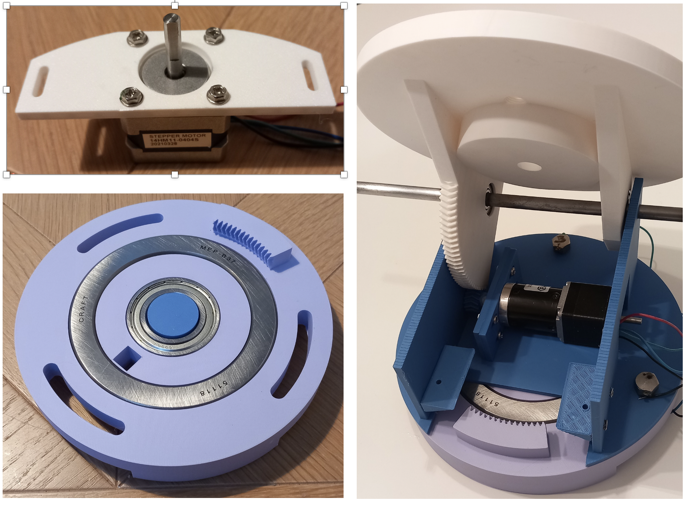
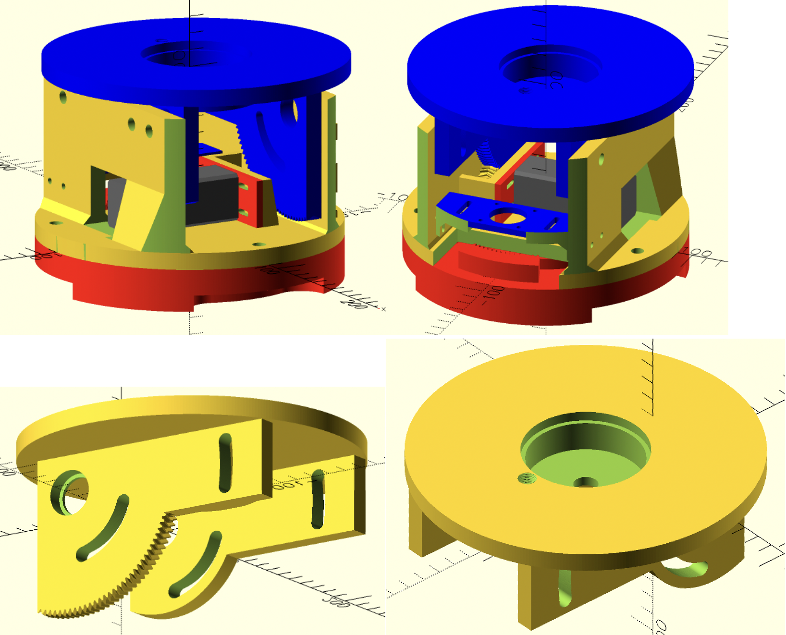
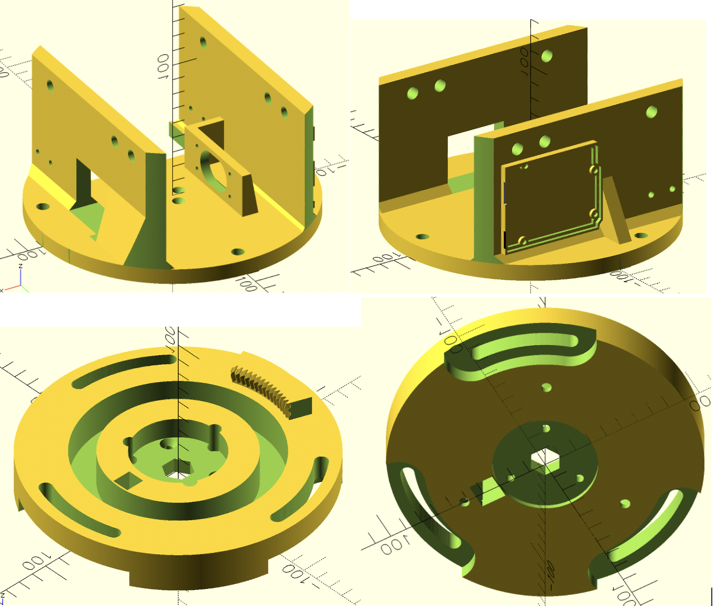
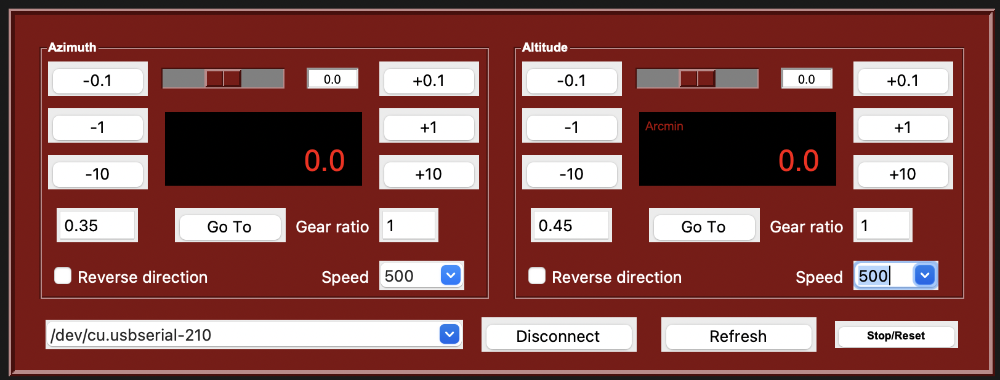

# Système d'alignement polaire automatique ouvert / Open Automatic Polar Alignment System

## Information :

Un système motorisé à deux axes (azimut et altitude) pour l'alignement polaire automatique avec TPPA dans NINA ou l'alignement polaire manuel avec un exécutable Windows d'AVALON 

A two‑axis (Azimuth & Altitude) motorized system for automatic polar‑alignment with TPPA in NINA or manual polar‑alignment with a Windows executable file from AVALON.

Le code tourne sur une carte Arduino UNO et émule le "protocol Avalon" de l'UPAS. Dans la première version, le code a été testé pour un driver de puissance TMC2130.

The code runs on an Arduino UNO board and emulates the UPAS "Avalon protocol". In the first version, the code was tested with a TMC2130 power driver.

Le système est en cours de développement pour des montures EQ5/EQ6 / The system is under development for an EQ5/EQ6 mounts. Coming soon stay tuned.

## Photos of version 1 :

## Screen photos of version 2 :

## First software tests with NINA and Avalon exe :

| # | Video | What you'll see |
|---|-------|-----------------|
| 1 |  | A first test with NINA by selecting the UPAS for Avalon |
| 2 |  | A second test with Polar Alignment, Windows executable from Avalon |

Finally, you can also used our own Python GUI interface : under test, coming soon.

## List of the material for version 2 :

| # | Component | Reference | Link |
|---|-------|-----------------|-----------------|
| 1 | Nema 11 stepper motor with gear 27:1 | 28JXS40K27 | |
| 2 | Nema 14 stepper motor | 14HM11-0404S | |
| 3 | gear to support the load and rotate | 51118 |  |
| 4 | gear to center the system and rotate  | F6006-ZZ | |
| 5 | gear between the middle and top components | 628-ZZ | |

## 3D files

See stl_file_version_2 directory

## References :

* **TPPA** – https://github.com/isbeorn/nina.plugin.polaralignment
* **INDI AAPAS** – https://github.com/michelebergo/indi-aapa
* **Serial Alt‑Az Polar Alignment Controller (ESP32 / GRBL / MPU-6500)** https://github.com/Totoleheros/tppa-compliant-motorized-polar-alignment

